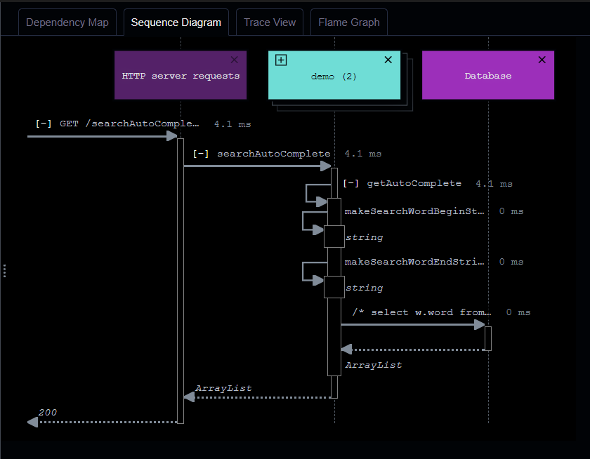

# APPMAP

# Swagger API Document is included
http://localhost:8080/swagger-ui/index.html#/

# Usecase
Refer to "/BoardBackend.postman_collection.json" File, You can test functions of this application with sending API protocol by postman.

# Start Project
> ./gradlew build 
> java -jar .\build\libs\demo-0.0.1-SNAPSHOT.jar
